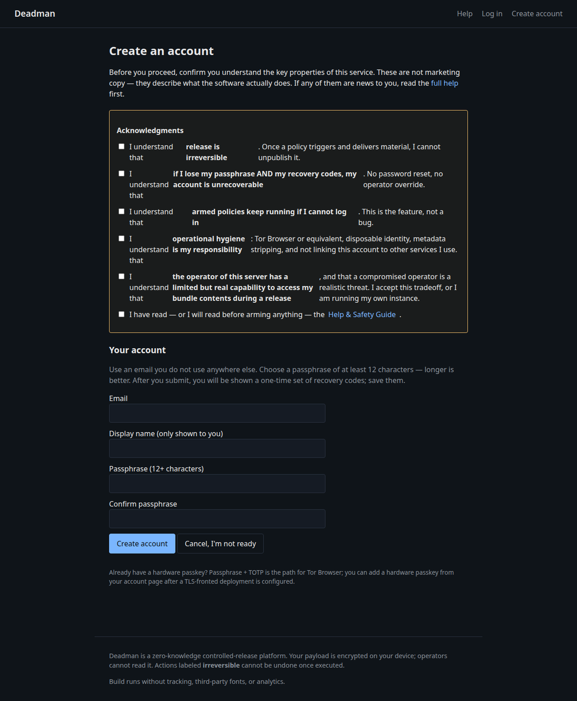
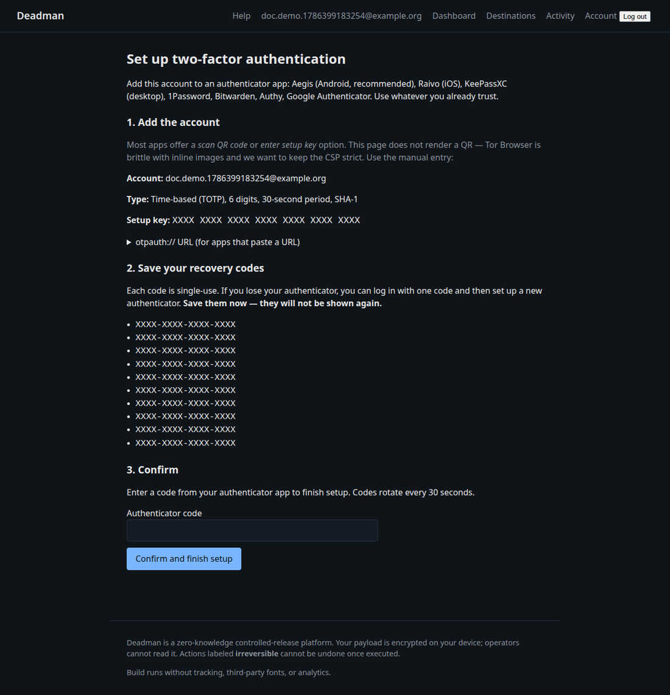
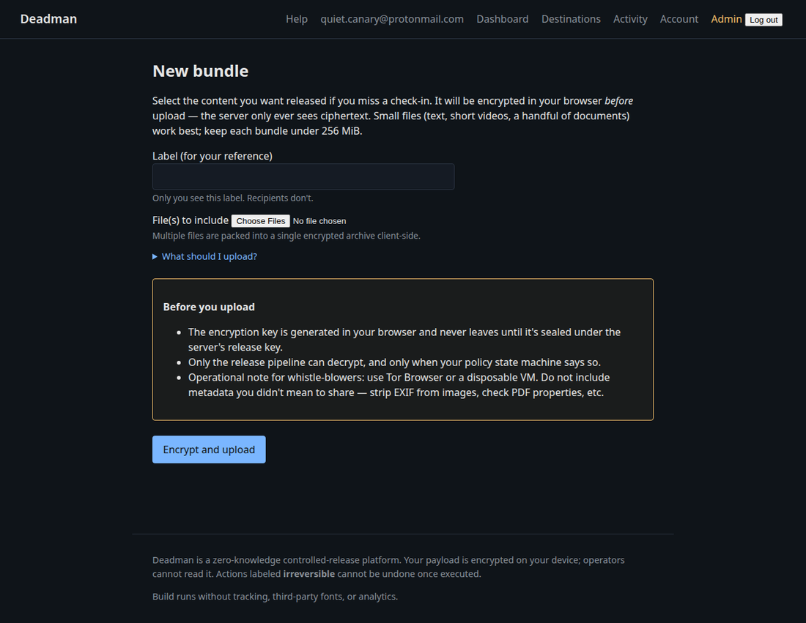
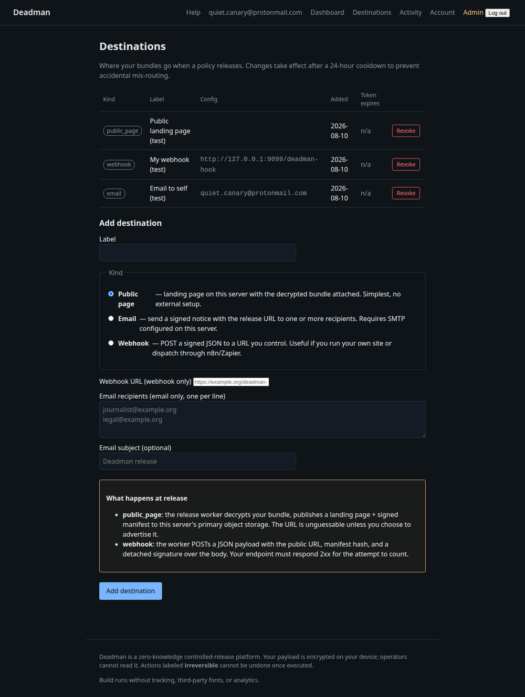
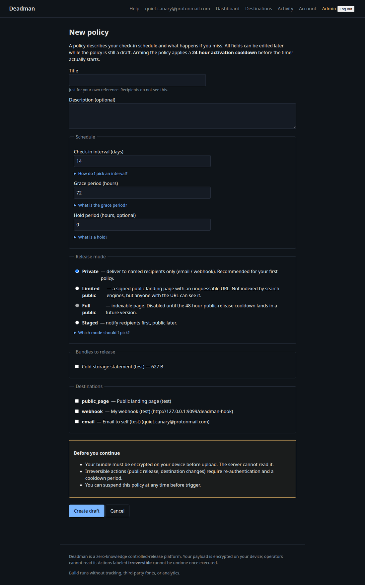
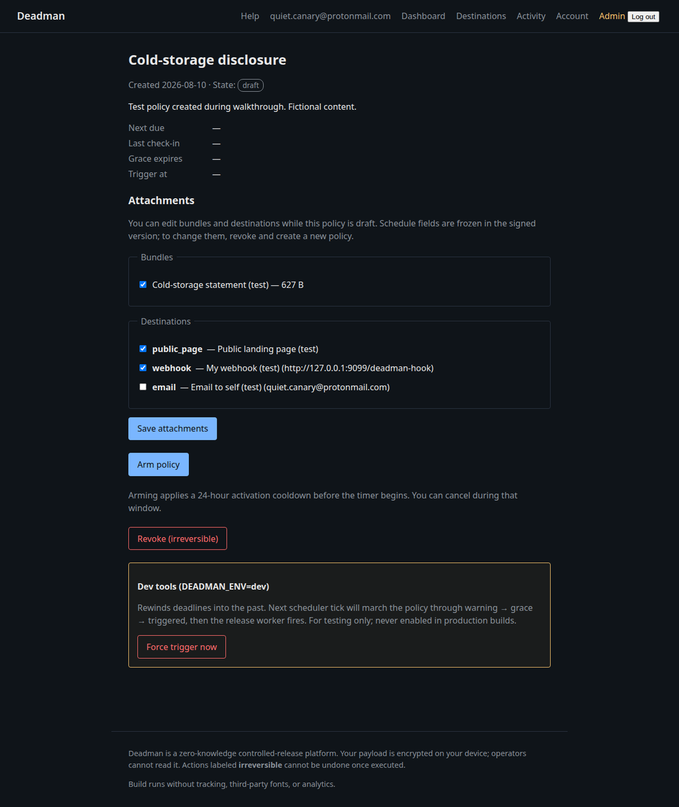
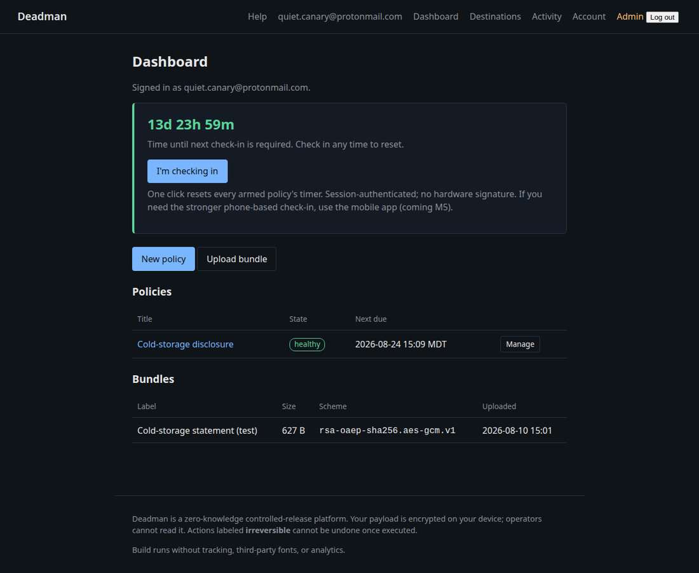
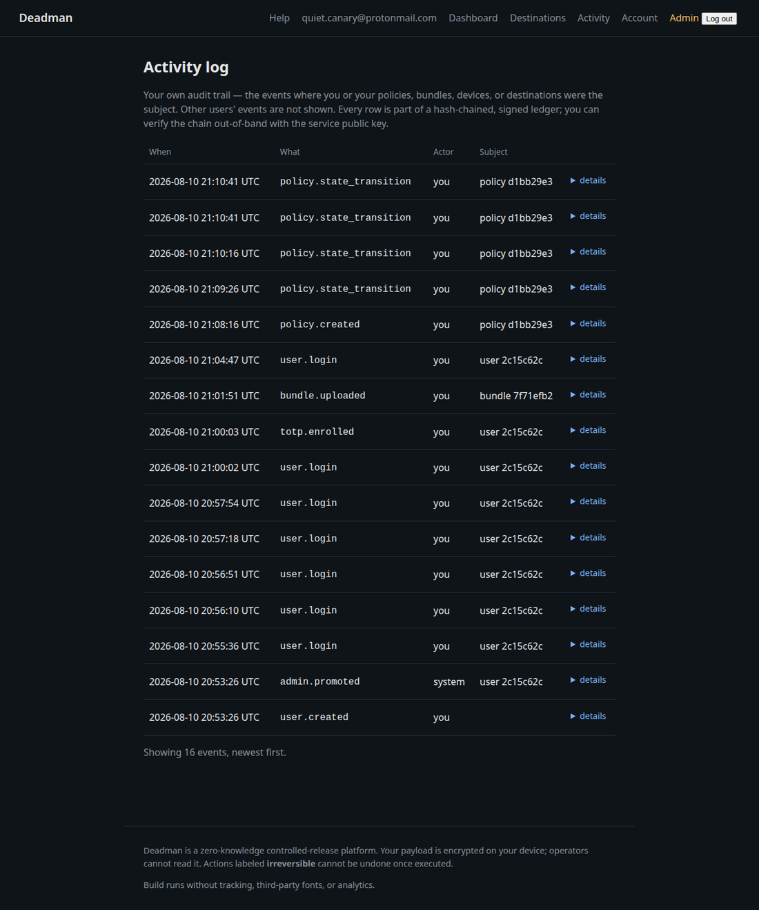
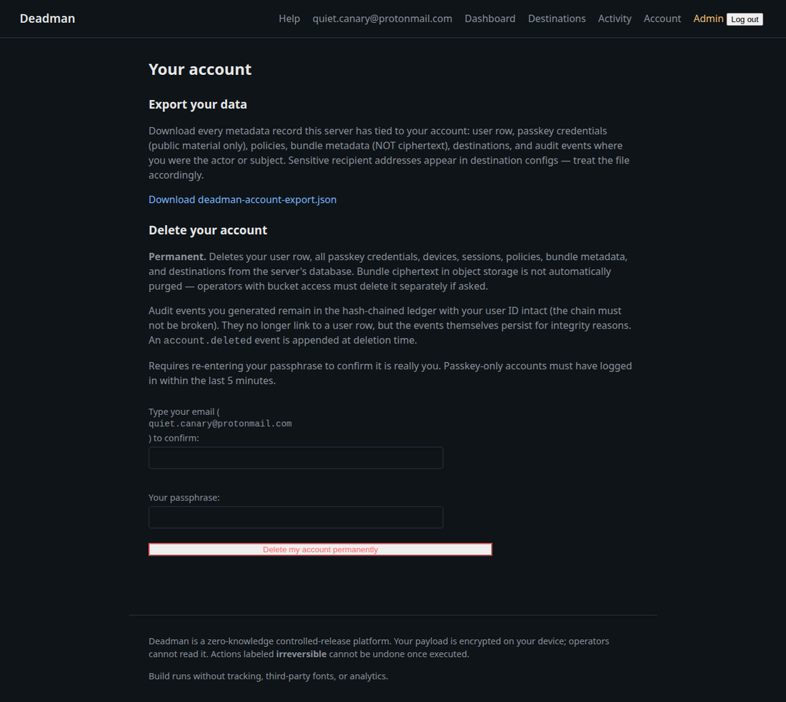

# User guide

This document is for someone with an account on a running Deadman
instance. If you're installing it, see
[quickstart.md](quickstart.md) instead.

## Concepts

- **Bundle.** The encrypted material that may be released. Plaintext
  never leaves your browser unencrypted; the server stores ciphertext
  only.
- **Destination.** Where a bundle goes if a release fires. Three
  kinds:
  - **Public page** — a landing page on the operator's storage with
    signed download links.
  - **Email** — sent to a list of recipients via the operator's SMTP.
  - **Webhook** — POST to a URL you control with a signed payload.
- **Policy.** Glues bundles to destinations with a check-in schedule
  and grace period. A policy is the unit that "fires."
- **Check-in.** A signed action proving you're alive. Resets the
  policy's countdown.
- **States.** A policy progresses: `draft` → `armed` → `healthy` →
  (`warning` → `grace` → `triggered` → `releasing` → `released`) when
  you stop checking in.

## Account setup

1. **Register.** Pick a 12+ character passphrase. Accept the six
   acknowledgments (these are not boilerplate — re-read them if any
   were surprising).
2. **Set up TOTP.** Add the account to an authenticator app (Aegis,
   Raivo, KeePassXC, 1Password, Bitwarden, Authy, Google
   Authenticator). The setup page shows a manual setup key — no QR.
   Save the 10 recovery codes **offline**, on paper or in cold
   storage. Each is single-use.
3. **Confirm** by entering the current 6-digit code from your app.

The acknowledgments are not boilerplate. Each one describes a property of
the software that has bitten someone: release is irreversible, armed
policies keep running if you can't log in, losing both your passphrase and
your recovery codes is unrecoverable.

There is no QR code by design (Tor Browser is brittle with inline images and
the CSP stays strict). Enter the setup key manually into your authenticator
app, then **save the ten recovery codes offline** — they are shown once and
are the only way back in if you lose your authenticator.

## Creating a bundle

`/ui/bundles/new` — pick a label and upload a file. The file is
encrypted in your browser before upload; only ciphertext leaves your
machine. The server stores the ciphertext + a wrap of the bundle key
under the platform release key.

Practical limits:

- Single-file uploads. To release multiple files, tar/zip them locally
  first.
- Bundle size cap is set by the operator; defaults are sized for
  documents (megabytes), not media archives.

## Creating a destination

`/ui/destinations`:

- **Public page** — no extra config. The operator must have a
  `DEADMAN_PUBLIC_BASE_URL` set for the landing page URL to be
  meaningful.
- **Email** — list of recipients (one per line) and an optional
  subject. The operator's SMTP credentials must be configured.
- **Webhook** — a URL. Payloads are signed with the server's audit
  key; verify with the public key from `/ui/admin/ledger` (or the
  out-of-band pin published by the operator).

Destinations can be revoked. A revoked destination is removed from any
policies that referenced it on next state transition.

## Creating and arming a policy

`/ui/policies/new`:

- **Title / description** — for your reference only; never published.
- **Check-in interval (days)** — how often you must check in. Common
  choices: 7, 14, 30, 90.
- **Grace period (hours)** — extra time after a missed check-in.
  Minimum 24 hours; the platform enforces this.
- **Hold period (hours)** — after grace expires, an additional fixed
  delay before publication. Useful if you have a trusted contact who
  should be notified before release.
- **Release mode** — `private` (no public landing page; email/webhook
  only) or `limited_public` (signed landing page on operator
  storage).
- **Bundles + destinations** — pick which.

After creation the policy is `draft`. **Arming** is a deliberate
action with confirmation:

1. From the policy page, click **Arm**.
2. Confirm again — you'll see the destination preview, sample
   announcement, and an irreversibility warning.
3. After arming, the policy enters a 24-hour activation cooldown
   (you can cancel during this window). Then the timer starts.

## Daily operation

- **Check in.** Click **I'm checking in** on the dashboard. Resets
  the timer for every armed policy you own.

  

- **Travel mode.** Suspend a policy via its detail page if you'll
  be unable to check in for a known period. Suspending requires
  step-up reauth.
- **Pause / resume.** Same UI as arm, with a re-auth gate.
- **Audit log.** `/ui/audit` shows every event that touched your
  policies — created, armed, check-in, warning issued, etc. Every row
  is signed and chains to the previous one.

  

## What happens if you stop checking in

Default schedule (overrideable per-policy by the operator):

| Time after last check-in | What happens |
| --- | --- |
| Interval reached | State → `warning`; push + email reminders begin |
| Interval + 24h | State → `grace`; escalation reminders |
| Interval + grace period | State → `triggered`; release worker picks up |
| Triggered + 1h publication delay | State → `releasing`; payload assembled, signed |
| Releasing complete | State → `released`; destinations notified, audit row sealed |

A check-in at any time before `triggered` resets the timer. After
`triggered`, the state machine is one-way.

## Recovery scenarios

### You lost access to your authenticator

Use a recovery code on the login page (the disclosure under the TOTP
field). Each code is single-use. Log in, set up a new authenticator
from the account page, and regenerate the unused codes.

### You lost both passphrase and recovery codes

There is no recovery. The operator cannot reset your passphrase. Your
account stays in whatever state it was last in — armed policies
continue to evaluate; releases will fire if you stop checking in.

### You want to delete your account

`/ui/account` → **Delete account**. Requires fresh step-up auth and
typed-email confirmation. Cascades to your policies, bundles,
destinations. Audit events tied to your account remain in the ledger
(removing them would break the chain), but no longer reference an
existing user row.

## Operational hygiene (please read)

- **Email.** Use an address you don't use anywhere else.
- **Passphrase manager.** Use one. The platform cannot reset it.
- **Tor Browser.** The canonical client. Don't try to make a regular
  browser work over Tor — there are subtle correlation risks.
- **Don't link the account to other identities.** Username, display
  name, recipient lists are all places where metadata can leak.
- **Test releases.** Operators can flip an instance into `dry_run`
  mode (admin → config). A dry run produces the full landing page +
  audit trail without actually publishing.
- **Have a backup channel.** If your check-ins depend on this single
  account being reachable, a single network outage can fire a
  release. Most users want longer grace periods than they think.
